<<<<<<< HEAD

<picture>
  <source media="(prefers-color-scheme: dark)" srcset="./dark.svg">
  <source media="(prefers-color-scheme: light)" srcset="./light.svg">
  
</picture>

 

## About

CSE student at **Patuakhali Science and Technology University (PSTU)**, currently learning C, C++, Java, JavaScript, HTML, and CSS — with a focus on competitive programming and problem solving.

## Focus

- Data Structures & Algorithms
- C++ (OOP, STL, Competitive Programming)
- Problem Solving

## Stats

- 🏆 **220+** problems solved on [Codeforces](https://codeforces.com/profile/shayon18) · Rating **960**
- 📈 **290+** problems solved on [LeetCode](https://leetcode.com/u/shayon18/)

## GitHub Activity

## Connect

- 🌐 Codeforces: [codeforces.com/profile/shayon18](https://codeforces.com/profile/shayon18)
- 🌐 LeetCode: [leetcode.com/u/shayon18](https://leetcode.com/u/shayon18/)
- 📧 Email: shayonboidya11@gmail.com

 

*"Keep learning, keep building, keep growing."*

=======
# 👋 Hi, I'm Shayon  

🎓 Student at **Patuakhali Science and Technology University (PSTU)**  
💻 Studying **Computer Science and Engineering (CSE)**  
⚡ Currently learning **C, C++, java, javascript, html, css**  
🏆 Solved **220+ problems** on Codeforces  
📊 Codeforces Rating: **960**  
📈 Solved **290+ problems** on LeetCode  
🚀 Passionate about **Competitive Programming & Problem Solving**  

---

## 🛠️ Skills & Learning
- C Programming  
- C++ (OOP, STL, Competitive Programming)  
- Data Structures & Algorithms  
- Problem Solving  

---

## 📊 GitHub Stats
  
  

---

## 🔗 Coding Profiles
- 🌐 Codeforces: https://codeforces.com/profile/shayon18 (Rating: 960)  
- 🌐 LeetCode: https://leetcode.com/u/shayon18/  

---

## 📫 Connect with me
- 📧 Email: *shayonboidya11@gmail.com*  

---

⭐️ *"Keep learning, keep building, keep growing."*
>>>>>>> 3932bfef2d2ff86c63b29dfa0314ddbc39c1409b
